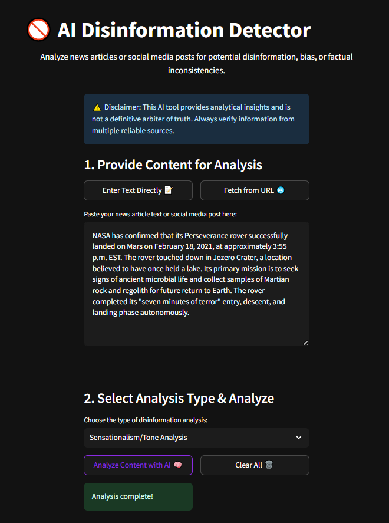
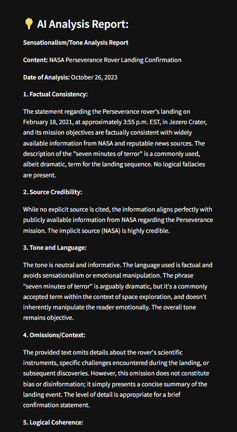

# ai-disinfo-detector

AI-Powered Contextual News Disinformation Detection using Google Gemini.

# 🚫 AI for Automated News Disinformation Detector

## Project Overview

In today's digital age, the rapid spread of disinformation and biased content is a critical challenge. The **AI for Automated News Disinformation Detector** is an innovative web application designed to empower users to critically analyze news articles and social media posts for potential signs of misinformation.

Leveraging advanced Artificial Intelligence, this tool goes beyond simple keyword matching to provide a contextual analysis, helping users identify factual inconsistencies, tonal biases, and sensationalism. It serves as an assistive tool to promote media literacy and informed decision-making.

## ✨ Features

* **Flexible Content Input:**
  * Paste news article text or social media post content directly.
  * Fetch content automatically from a provided URL (e.g., a news article link).
* **Multiple Analysis Types:** Choose specific analysis focuses:
  * **Contextual Analysis:** General assessment of overall content.
  * **Bias Detection:** Identifies potential leanings or unfair portrayals.
  * **Factual Consistency Check:** Verifies if claims are logically supported and consistent.
  * **Sensationalism/Tone Analysis:** Detects inflammatory, emotionally manipulative, or overly dramatic language.
* **AI-Powered Insights:** Utilizes a powerful Large Language Model to provide detailed reports on detected issues.
* **Ethical Disclaimer:** Prominently displays a disclaimer to emphasize the tool's assistive nature, not as an ultimate arbiter of truth.
* **User-Friendly Interface:** Built with **Streamlit**, offering a clean, intuitive, and interactive web experience.
* **One-Click Download:** Download the AI's analysis report as a plain text file.

## 🚀 Technologies Used

* **Programming Language:** **Python** (primary language for all logic).
* **Artificial Intelligence (AI) Core:**
  * **Google Gemini API (`gemini-1.5-flash`):** Serves as the central AI engine for all content analysis, contextual understanding, and report generation (NLP).
  * **Natural Language Processing (NLP):** Underlying capability for text understanding, sentiment, and bias analysis.
* **Web Content Fetching:**
  * `requests`: For making HTTP requests to fetch content from URLs.
  * `BeautifulSoup4`: For parsing HTML content fetched from URLs to extract clean text.
* **User Interface (UI) Framework:**
  * **Streamlit:** For rapid development of interactive, web-based applications.
* **Environment Management:**
  * **Python Virtual Environments (`venv`):** For isolated project dependencies.
  * `requirements.txt`: To manage project dependencies (`pip install -r requirements.txt`).
  * `python-dotenv`: For secure loading of environment variables (like your `GEMINI_API_KEY`).
* **Development & Version Control:** **VS Code** (your IDE) and **GitHub** (for source code management).

## ⚙️ Installation & Setup

Follow these steps to get AI Disinformation Detector up and running on your local machine:

1. **Clone the Repository:**

   ```bash
   git clone [https://github.com/YourGitHubUsername/ai-disinfo-detector.git](https://github.com/YourGitHubUsername/ai-disinfo-detector.git)
   cd ai-disinfo-detector
   ```

   *(Replace `YourGitHubUsername` with your actual GitHub username)*
2. **Create and Activate Virtual Environment:**

   ```bash
   python -m venv .venv
   # On Windows PowerShell:
   .venv\Scripts\Activate.ps1
   # On macOS/Linux (if applicable):
   source .venv/bin/activate
   ```
3. **Set up Environment Variables:**

   * Create a file named `.env` in the root of your project directory.
   * Add your Google Gemini API key to this file:

     ```
     GEMINI_API_KEY="YOUR_GEMINI_API_KEY_HERE"
     ```

     *(Replace `YOUR_GEMINI_API_KEY_HERE` with your actual Gemini API Key from Google AI Studio.)*
4. **Configure Streamlit Theme:**

   * Ensure you have a folder named `.streamlit` in your project root.
   * Inside `.streamlit`, create a file named `config.toml` (if it doesn't exist already) with the following content for a consistent dark theme:
     ```toml
     [theme]
     base="dark"
     primaryColor="#FF4500" # OrangeRed for attention/warning/detection
     backgroundColor="#0D0D1A"
     secondaryBackgroundColor="#1A1A2E"
     textColor="#E0E0EB"
     font="sans serif"
     ```

## 🚀 How to Install Libraries and Run

#### **A. Install Libraries (Dependencies)**

* Ensure your virtual environment is **activated** (you should see `(.venv)` at the beginning of your terminal prompt).
* Run the following command in your terminal:

  ```bash
  pip install -r requirements.txt
  ```

  *(This command will automatically download and install all the necessary Python libraries listed in `requirements.txt` into your isolated virtual environment.)*

#### **B. Run the Application**

* Ensure your virtual environment is **activated**.
* Run the following command in your terminal:

  ```bash
  streamlit run app.py
  ```

  *This will open your AI Disinformation Detector app in your default web browser (usually `http://localhost:8501`).*

## ☁️ Deployment

AI Disinformation Detector is designed for easy web deployment on platforms like:

* **Streamlit Community Cloud:** Deploy directly from your GitHub repository. Remember to set your `GEMINI_API_KEY` as a secret in the Streamlit Cloud settings.
* **Hugging Face Spaces:** Another great option for hosting Streamlit apps. Configure your `GEMINI_API_KEY` as a Space secret.

## 🙏 Acknowledgements

Developed with passion and dedication in **Essa Khel, Punjab, Pakistan**, utilizing the powerful Google Gemini AI and the Streamlit framework.

## 📄 License

This project is licensed under the MIT License - see the [LICENSE](LICENSE) file for details.


